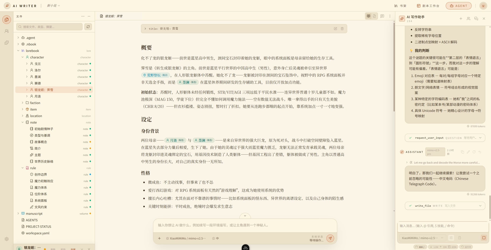

# NeuroBook

[中文](README.md) | [English](README.en.md)

[](https://github.com/notnotype/neuro-book/releases)
[](https://github.com/notnotype/neuro-book/pkgs/container/neuro-book)
[](https://bun.sh/)
[](LICENSE)

**NeuroBook 是一个本地优先的长篇小说 AI 创作 IDE。** 它不是又一个聊天框：用世界引擎管住设定与时间线，用各司其职的多 Agent 流水线推进剧情和章节，再用 llmlint 检查掉 AI 味——整部作品以 Markdown 文件和 SQLite 保存在你自己手里。

<div style="display: flex; justify-content: space-between;">
  
  
  
</div>
<br/>

> 🖥️ 在线试用：http://8.148.4.22:3001/ ｜ 📦 [Windows 免安装包下载](https://github.com/notnotype/neuro-book/releases)

## 为什么是 NeuroBook

AI 能写好一段文字，但写不好一部长篇：设定会漂移，时间线会混乱，写到几十万字就开始吃书；一整章丢给模型，回来的文字带着一股 AI 味。NeuroBook 把长篇创作当作一个 IDE 问题来解决：

- 设定、正文、剧情和世界状态都是 Project Workspace 里可见的文件，作者和 Agent 共同维护，而不是锁在对话记录里。
- 世界状态有专门的引擎和时间轴，不依赖模型的记忆力。
- 写作由多个职责明确的 Agent 协作完成，检索、规划、写作、审校各归其位，而不是一次模型调用包打天下。

## 核心能力

### 🌍 World Engine：不吃书的世界状态引擎

长篇最大的敌人是设定漂移。World Engine 用「时间线 + 切面」做事件溯源：每个重要时间点记录一次状态变更，任意时刻的世界状态都由该时刻之前的切面推算得出——角色三个月前受的伤、王国十年前的国库存量，随时可查、不会漂移。补设定就是在合适的时间点插入一个切面，倒叙和回忆天然支持。

- 用 Zod schema 定义你自己的世界结构：人物、门派、王国、大陆都可以是有状态的 subject。
- 自定义历法：现实公历、简化纪年或完全架空的历法都支持，公元前也能算。
- Agent 通过沙箱化的 `execute_world` 读写世界状态：leader 可写、writer 只读，权限分明。
- 剧情 Scene 直接锚定世界时间轴、地点和出场角色，剧情规划与世界状态互相咬合。

### ✍️ 领域化多 Agent 写作流水线

写作不是一句 prompt 的事。NeuroBook 把创作拆给不同职责的 Agent：leader 负责剧情规划与调度，writer 专职正文，retrieval / researcher 负责查设定查资料。默认写作主链是：灵感探索 → 项目与世界书初始化 → World Engine 建档 → 剧情规划与状态推进 → 章节写作 → 写后回补。每个 Agent 有独立的工具白名单和上下文边界，全程支持人工审批（HITL）、上下文压缩和会话树回溯。

### 🧹 llmlint：给文字做 lint，去掉 AI 味

像 eslint 检查代码一样检查稿件。340 条规则覆盖填充词、机械过渡、公式化设问、二元对比、空泛总结、节奏单调等典型 AI 写作痕迹；静态正则规则秒级扫全稿，LLM 规则做语境判断，机械问题支持自动修复。既是编辑器里的润色 Skill，也是独立 CLI：[notnotype/llmlint](https://github.com/notnotype/llmlint)。

### 📂 文件化 Project Workspace：作品在你手里

`lorebook/`（世界书）、`manuscript/`（正文）、`reference/`（素材）、`world-engine/`（世界配置）都是本地 Markdown / TypeScript 文件，加上项目级 SQLite。没有云端锁定：随时整包迁移、随时用任何编辑器打开、随时让 Agent 在明确权限内读写同一份文件。模型 Provider 和 API Key 由你自己配置。

### 📝 Markdown Studio 与 Inline AI

写作主界面是完整的 Markdown 编辑器：左侧文件树、角色面板、剧情工作台随手切换。选中文字即可唤起 Inline AI 在后台改稿，流式预览修改、不打断你的编辑流、不占用主 Agent 会话。

### 🎭 SillyTavern 角色卡迁移

`inspect → unpack → import` 三段式导入 SillyTavern 角色卡：原始卡片与 worldbook 完整归档，稳定设定迁入 lorebook，动态机制素材保留归档。AI RP 模式的入口正在按写作模式的标准重新设计中。

## 快速开始

**Windows：解压即用。** 从 [GitHub Releases](https://github.com/notnotype/neuro-book/releases) 下载 zip，解压后运行：

```powershell
.\Start Neuro Book.cmd
```

包内内置 Bun runtime 和预构建产物，不 clone 源码、不装依赖、不跑构建；首次启动自动初始化数据并引导创建管理员。之后用 `.\Update Neuro Book.cmd` 一键升级，`data/` 中的作品和配置全部保留。

**服务器 / Docker：**

```bash
bunx --bun --package github:notnotype/neuro-book neuro-book-deploy
```

| 方式 | 适合 |
| --- | --- |
| Windows Product Portable | Windows 本机用户，解压即用 |
| ghcr | 服务器 Docker 部署，拉取预构建镜像，低内存友好 |
| Product Bun | 已有 Bun 的本机或服务器，免源码运行 |
| Source Dev | 开发者，源码开发和测试 |

完整的部署、更新、管理员与模型配置说明见 [docs/deployment.md](docs/deployment.md)。要让其他 AI Agent 协助部署或排障，把 [docs/operator-bridge.md](docs/operator-bridge.md) 发给它即可。

## 面向开发者：可编程的 Agent 底座

NeuroBook 的 Agent 系统构建在自研 NeuroAgentHarness 上（基于 Pi 框架的 multi-provider、tool calling、append-only session tree 扩展），并且整个 Agent 行为层是可编程的：

- **Profile**：声明式定义 Agent 的工具白名单、输入 / 输出 Schema、系统提示词、压缩与摘要策略和 Runtime Hooks。
- **TSX Profile**：用类型安全的 TSX 模板描述 Agent 上下文结构（System、History、Dynamic Context、Reminder、Import、SkillCatalog），可预览、可低代码编辑。
- **Sidecar Context**：在主任务前后 fork runtime-only 分支做检索、反思和记忆维护，旁路 transcript 不进入主 history，只把整理结果合并回主线。

本地开发：

```bash
bun install
bun run dev
```

常用命令：`bun run typecheck`、`bun run test`、`bun run docs:dev`。

## 文档

- [官网文档首页](docs/index.md)
- [快速开始](docs/quick-start.md)
- [基础教程：从第一本书到第一次 RP](docs/tutorials/index.md)
- [部署方式](docs/deployment.md)
- [Agent 心智模型](docs/agent/index.md)
- [Profile 介绍](docs/profile/index.md) / [Profile TSX 介绍](docs/profile-tsx/index.md)
- [Sidecar Context](docs/agent/sidecar.md)
- [NeuroBook Reference Bookshelf](reference/README.md)
- [PROJECT-STATUS.md](PROJECT-STATUS.md)

## License

This project is source-available under the [PolyForm Noncommercial License 1.0.0](LICENSE). You may use, study, modify, and share the software for noncommercial purposes.

Commercial use requires prior written permission from the copyright holder. Personal authors may use NeuroBook to create, edit, and publish their own original works, including commercially published writing. The commercial restriction applies to commercial use of the software itself, not to the user's original creative output.

## Star History

<a href="https://www.star-history.com/?repos=notnotype%2Fneuro-book&type=date&legend=top-left">
 <picture>
   <source media="(prefers-color-scheme: dark)" srcset="https://api.star-history.com/chart?repos=notnotype/neuro-book&type=date&theme=dark&legend=top-left" />
   <source media="(prefers-color-scheme: light)" srcset="https://api.star-history.com/chart?repos=notnotype/neuro-book&type=date&legend=top-left" />
   
 </picture>
</a>
